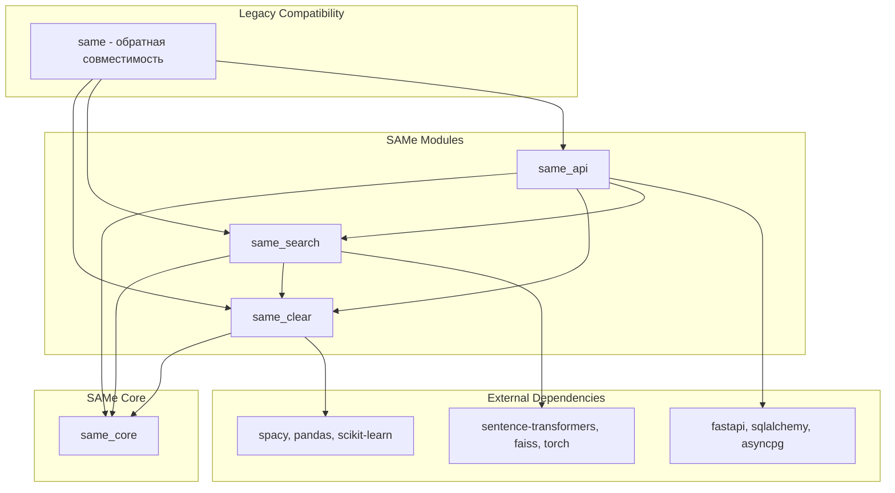

# 🏗️ Архитектура SAMe - Модульная система

Документация по модульной архитектуре SAMe с разделением на независимые модули.

## 📋 Обзор архитектуры

SAMe был реорганизован в модульную систему для улучшения:
- **Модульности** - четкое разделение ответственности
- **Переиспользования** - модули можно использовать независимо
- **Тестирования** - изолированное тестирование компонентов
- **Развертывания** - гибкие варианты развертывания

## 🧩 Модули системы

### 🧹 same_clear - Обработка и очистка текста

**Назначение**: Предобработка, очистка и нормализация текстовых данных

**Основные компоненты**:
- `text_processing/` - Обработка текста
- `parameter_extraction/` - Извлечение параметров
- `utils/` - Утилиты обработки

**Зависимости**:
- `same_core` - Общие интерфейсы
- Внешние: `spacy`, `pandas`, `scikit-learn`

### 🔍 same_search - Поиск и индексация

**Назначение**: Поисковые алгоритмы, ML модели и кэширование

**Основные компоненты**:
- `search_engine/` - Поисковые движки
- `models/` - Управление ML моделями
- `caching/` - Кэширование результатов
- `monitoring/` - Мониторинг производительности

**Зависимости**:
- `same_core` - Общие интерфейсы
- `same_clear` - Для предобработки запросов
- Внешние: `sentence-transformers`, `faiss`, `torch`

### 🌐 same_api - API и интеграции

**Назначение**: Web API, база данных, экспорт данных

**Основные компоненты**:
- `api/` - FastAPI приложение
- `database/` - ORM модели и операции
- `export/` - Экспорт результатов
- `data_manager/` - Управление данными
- `settings/` - Конфигурация системы

**Зависимости**:
- `same_core` - Общие интерфейсы
- `same_clear` - Для обработки данных
- `same_search` - Для поисковых операций
- Внешние: `fastapi`, `sqlalchemy`, `pandas`

### 🔧 same_core - Общие компоненты

**Назначение**: Базовые интерфейсы, типы данных и утилиты интеграции

**Основные компоненты**:
- `interfaces.py` - Абстрактные интерфейсы
- `types.py` - Общие типы данных
- `exceptions.py` - Исключения системы
- `integration.py` - Утилиты интеграции

## 🔗 Диаграмма зависимостей



## 📦 Структура файлов

```
src/
├── same_core/                     # 🔧 Общие компоненты
│   ├── __init__.py
│   ├── interfaces.py              # Базовые интерфейсы
│   ├── types.py                   # Общие типы данных
│   ├── exceptions.py              # Исключения системы
│   └── integration.py             # Утилиты интеграции
│
├── same_clear/                    # 🧹 Обработка текста
│   ├── __init__.py
│   ├── text_processing/           # Предобработка текста
│   │   ├── __init__.py
│   │   ├── text_cleaner.py        # Очистка от HTML, спецсимволов
│   │   ├── lemmatizer.py          # Лемматизация с SpaCy
│   │   ├── normalizer.py          # Нормализация терминов
│   │   ├── preprocessor.py        # Основной предобработчик
│   │   ├── enhanced_preprocessor.py # Улучшенный предобработчик
│   │   ├── units_processor.py     # Обработка единиц измерения
│   │   ├── synonyms_processor.py  # Обработка синонимов
│   │   └── tech_codes_processor.py # Технические коды
│   ├── parameter_extraction/      # Извлечение параметров
│   │   ├── __init__.py
│   │   ├── regex_extractor.py     # Regex-извлечение
│   │   ├── ml_extractor.py        # ML-извлечение
│   │   ├── parameter_parser.py    # Парсинг параметров
│   │   └── parameter_utils.py     # Утилиты параметров
│   └── utils/                     # Утилиты обработки
│       ├── __init__.py
│       └── case_converter.py      # Конвертация регистра
│
├── same_search/                   # 🔍 Поиск и индексация
│   ├── __init__.py
│   ├── search_engine/             # Поисковые движки
│   │   ├── __init__.py
│   │   ├── fuzzy_search.py        # Нечеткий поиск (TF-IDF)
│   │   ├── semantic_search.py     # Семантический поиск (BERT)
│   │   ├── hybrid_search.py       # Гибридный поиск
│   │   └── indexer.py             # Индексация документов
│   ├── models/                    # ML модели
│   │   ├── __init__.py
│   │   ├── model_manager.py       # Управление моделями
│   │   ├── memory_monitor.py      # Мониторинг памяти
│   │   ├── quantization.py        # Квантизация моделей
│   │   └── exceptions.py          # Исключения моделей
│   ├── caching/                   # Кэширование
│   │   ├── __init__.py
│   │   └── advanced_cache.py      # Продвинутое кэширование
│   ├── monitoring/                # Мониторинг
│   │   ├── __init__.py
│   │   └── analytics.py           # Аналитика производительности
│   └── categorization/            # Категоризация (опционально)
│       ├── __init__.py
│       └── category_classifier.py # Классификатор категорий
│
├── same_api/                      # 🌐 API и интеграции
│   ├── __init__.py
│   ├── api/                       # FastAPI приложение
│   │   ├── __init__.py
│   │   ├── create_app.py          # Создание приложения
│   │   ├── router_main.py         # Основные роутеры
│   │   ├── websocket.py           # WebSocket поддержка
│   │   ├── routers/               # API роутеры
│   │   │   └── search/
│   │   │       └── router.py      # Поисковые endpoints
│   │   ├── configuration/         # Конфигурация API
│   │   │   ├── __init__.py
│   │   │   ├── server.py          # Настройки сервера
│   │   │   └── schemas/           # Pydantic схемы
│   │   └── middleware/            # Middleware
│   ├── database/                  # База данных
│   │   ├── __init__.py
│   │   ├── base.py                # Базовые модели
│   │   ├── engine.py              # Движок БД
│   │   ├── optimizations.py       # Оптимизации БД
│   │   ├── models/                # ORM модели
│   │   │   ├── __init__.py
│   │   │   ├── user.py            # Модель пользователя
│   │   │   ├── item.py            # Модель элемента
│   │   │   └── item_parameter.py  # Параметры элемента
│   │   └── orm/                   # ORM операции
│   ├── export/                    # Экспорт данных
│   │   ├── __init__.py
│   │   ├── excel_exporter.py      # Excel экспорт
│   │   └── report_generator.py    # Генерация отчетов
│   ├── data_manager/              # Управление данными
│   │   ├── __init__.py
│   │   └── DataManager.py         # Основной менеджер
│   └── settings/                  # Конфигурация
│       ├── __init__.py
│       └── config.py              # Настройки приложения
│
└── same/                          # 🔄 Обратная совместимость
    ├── __init__.py                # Прокси-импорты
    └── analog_search_engine.py    # Главный класс (обновлен)
```

## 🔌 Интерфейсы и контракты

### Базовые интерфейсы (same_core/interfaces.py)

```python
class TextProcessorInterface(ABC):
    """Интерфейс для обработки текста"""
    @abstractmethod
    def process_text(self, text: str) -> ProcessingResult:
        pass

class SearchEngineInterface(ABC):
    """Интерфейс для поисковых движков"""
    @abstractmethod
    def fit(self, documents: List[str], document_ids: List[str]) -> None:
        pass
    
    @abstractmethod
    def search(self, query: str, top_k: int = 10) -> List[SearchResult]:
        pass

class ExporterInterface(ABC):
    """Интерфейс для экспорта данных"""
    @abstractmethod
    def export_data(self, data: pd.DataFrame, filepath: Path) -> None:
        pass
```

### Типы данных (same_core/types.py)

```python
@dataclass
class ProcessingResult:
    """Результат обработки текста"""
    original: str
    processed: str
    stages: Dict[ProcessingStage, str]
    metadata: Dict[str, Any]
    processing_time: float

@dataclass
class SearchResult:
    """Результат поиска"""
    document_id: str
    content: str
    score: float
    metadata: Dict[str, Any]
    rank: int
```

## 🔄 Обратная совместимость

### Механизм прокси-импортов

Файл `same/__init__.py` содержит динамические импорты:

```python
def __getattr__(name: str):
    """Динамический импорт для обратной совместимости"""
    
    if name in text_processing_components:
        _deprecated_import_warning(f'same.{name}', f'same_clear.text_processing.{name}')
        try:
            import same_clear.text_processing as tp_module
            return getattr(tp_module, name)
        except (ImportError, AttributeError):
            # Fallback на старый импорт
            import same.text_processing as old_tp_module
            return getattr(old_tp_module, name)
```

### Предупреждения об устаревших импортах

```python
def _deprecated_import_warning(old_path: str, new_path: str):
    warnings.warn(
        f"Importing from '{old_path}' is deprecated. Use '{new_path}' instead.",
        DeprecationWarning,
        stacklevel=4
    )
```

## 🚀 Развертывание модулей

### Независимое развертывание

Каждый модуль может быть установлен отдельно:

```bash
# Только обработка текста
pip install -e ./src/same_clear

# Только поиск
pip install -e ./src/same_search

# Только API
pip install -e ./src/same_api

# Все модули
pip install -e .
```

### Docker контейнеры

```dockerfile
# Контейнер только для обработки текста
FROM python:3.9-slim
COPY src/same_core ./same_core
COPY src/same_clear ./same_clear
RUN pip install -e ./same_clear

# Контейнер для поиска
FROM python:3.9-slim
COPY src/same_core ./same_core
COPY src/same_clear ./same_clear
COPY src/same_search ./same_search
RUN pip install -e ./same_search

# Полный контейнер
FROM python:3.9-slim
COPY src/ ./src/
RUN pip install -e .
```

## 🧪 Тестирование архитектуры

### Структура тестов

```
tests/
├── test_same_core/           # Тесты общих компонентов
├── test_same_clear/          # Тесты обработки текста
├── test_same_search/         # Тесты поиска
├── test_same_api/            # Тесты API
├── integration_tests/        # Интеграционные тесты
└── compatibility_tests/      # Тесты обратной совместимости
```

### Изоляция тестов

Каждый модуль тестируется независимо:

```python
# test_same_clear/test_text_processing.py
def test_text_cleaner_isolation():
    """Тест изолированной работы TextCleaner"""
    from same_clear.text_processing import TextCleaner
    # Тест без зависимостей от других модулей

# integration_tests/test_full_pipeline.py  
def test_full_pipeline():
    """Тест полного пайплайна"""
    from same_clear.text_processing import TextCleaner
    from same_search.search_engine import FuzzySearchEngine
    from same_api.export import ExcelExporter
    # Тест интеграции всех модулей
```

## 📊 Метрики и мониторинг

### Производительность модулей

- **same_clear**: Время обработки текста, количество извлеченных параметров
- **same_search**: Время поиска, точность результатов, использование памяти
- **same_api**: Время ответа API, пропускная способность, ошибки

### Мониторинг зависимостей

```python
from same_core.integration import module_registry

# Проверка доступности модулей
for module_name in ['same_clear', 'same_search', 'same_api']:
    if module_registry.check_dependencies(module_name):
        print(f"✅ {module_name} ready")
    else:
        print(f"❌ {module_name} missing dependencies")
```

## 🔮 Будущее развитие

### Планируемые улучшения

1. **Микросервисная архитектура**: Развертывание модулей как отдельных сервисов
2. **Плагинная система**: Динамическая загрузка дополнительных модулей
3. **Распределенная обработка**: Горизонтальное масштабирование модулей
4. **GraphQL API**: Более гибкий API для интеграции

### Расширяемость

Новые модули могут быть легко добавлены:

```python
# same_ml/ - новый модуль машинного обучения
# same_viz/ - новый модуль визуализации
# same_nlp/ - расширенный NLP модуль
```

## 📚 Дополнительные ресурсы

- [MIGRATION_GUIDE.md](../MIGRATION_GUIDE.md) - Руководство по миграции
- [API_REFERENCE.md](API_REFERENCE.md) - Справочник API (создается)
- [notebooks/demo/SAMe_Demo_New_Architecture.ipynb](../notebooks/demo/SAMe_Demo_New_Architecture.ipynb) - Демо новой архитектуры
- [README.md](../README.md) - Обновленная документация проекта

## 🎯 Заключение

Новая модульная архитектура SAMe обеспечивает:

- ✅ **Четкое разделение ответственности** между модулями
- ✅ **Гибкость развертывания** - используйте только нужные компоненты
- ✅ **Простоту тестирования** - изолированное тестирование модулей
- ✅ **Обратную совместимость** - старый код продолжает работать
- ✅ **Расширяемость** - легко добавлять новые модули
- ✅ **Переиспользование** - модули можно использовать в других проектах

Эта архитектура подготавливает SAMe к будущему росту и развитию, обеспечивая масштабируемость и поддерживаемость системы.
