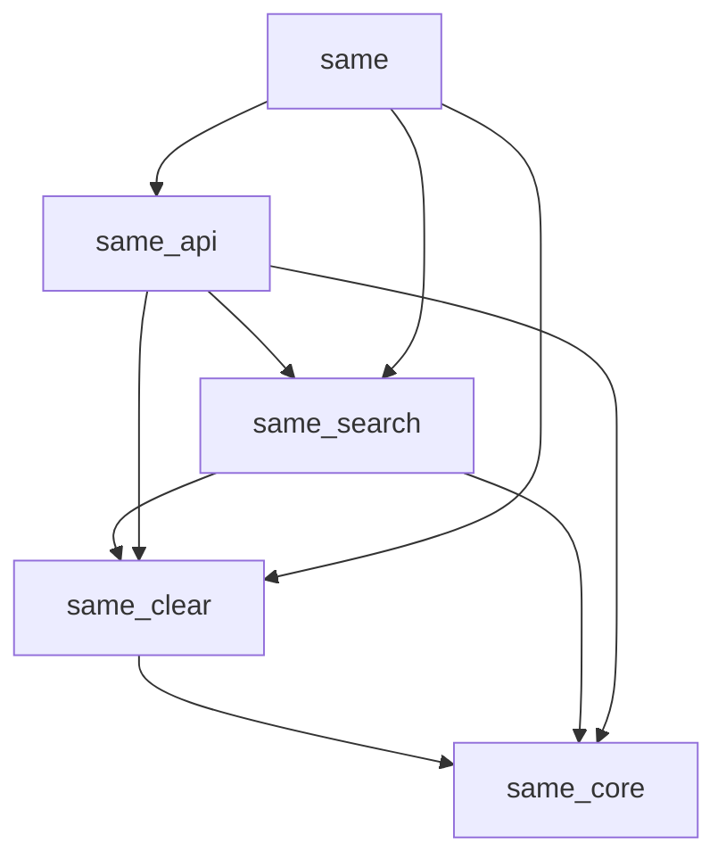

# Архитектура SAMe (актуальная)

- Модули в `src/`:
  - `same_core`: интерфейсы, типы, исключения
  - `same_clear`: предобработка текста и извлечение параметров
  - `same_search`: движки поиска (fuzzy/semantic/hybrid), индексация
  - `same_api`: FastAPI, БД, Celery-задачи, экспорт
  - `same`: совместимость, высокоуровневый `AnalogSearchEngine`

- Точка входа API: `same_api.api.create_app:create_app`
- Регистрация роутов: авто-дискавери через `same_api.api.configuration.routers.Routers`
- Ключевые эндпоинты: `same_api.api.routers.searh.router`

## Потоки данных
1. Загрузка каталога: `/search/upload-catalog` → Celery → сохранение моделей → `/search/activate-models`
2. Поиск: `/search/initialize` → `AnalogSearchEngine` → предобработка (`same_clear`) → движки (`same_search`) → выдача
3. Экспорт: `/search/export-results` → `same_api.export.excel_exporter`

## Конфигурация
- Pydantic Settings: `same_api.settings.config.Settings`
- Переменные окружения: `RUN__*`, `DATABASE_URL`, `LOGGING__LEVEL`, и т.д.

## Важные файлы
- `src/same/analog_search_engine.py`
- `src/same_search/search_engine/{fuzzy_search,semantic_search,hybrid_search}.py`
- `src/same_api/api/{create_app.py,configuration/server.py,routers/searh/router.py}`
