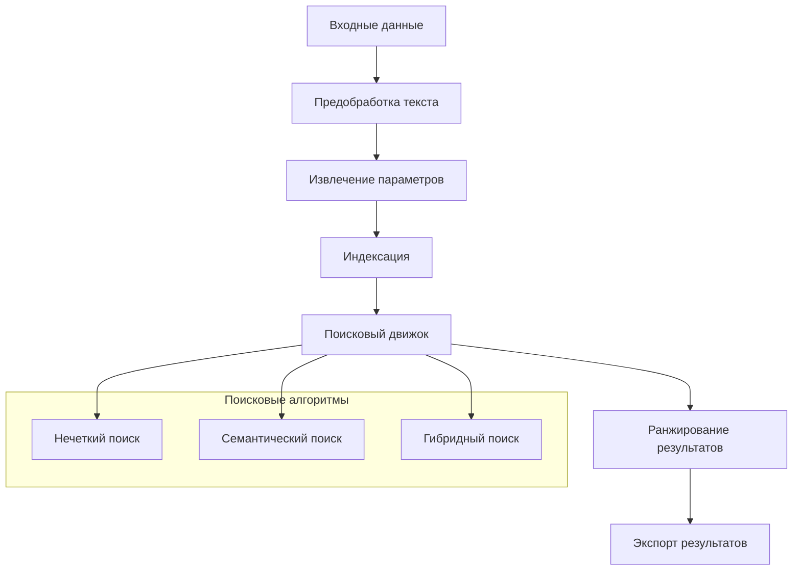

# SAMe - Search Analog Model Engine

[](https://www.python.org/downloads/)
[](https://fastapi.tiangolo.com/)
[](LICENSE)
[](tests/)

Система поиска аналогов материально-технических ресурсов (МТР) с использованием современных методов машинного обучения и обработки естественного языка.

## 🚀 Возможности

- **Интеллектуальный поиск аналогов** - Нечеткий, семантический и гибридный поиск
- **Обработка естественного языка** - Предобработка и нормализация технических наименований
- **Извлечение параметров** - Автоматическое извлечение технических характеристик
- **Масштабируемость** - Поддержка больших каталогов МТР
- **REST API** - Простая интеграция с существующими системами
- **Экспорт результатов** - Детальные отчеты в Excel и других форматах

## 🏗️ Архитектура



## 🛠️ Технологии

- **Python 3.9+** - Основной язык разработки
- **FastAPI** - Веб-фреймворк для API
- **SpaCy** - Обработка естественного языка
- **scikit-learn** - Машинное обучение
- **Sentence Transformers** - Семантические эмбеддинги
- **FAISS** - Быстрый поиск по векторам
- **PostgreSQL** - База данных
- **Docker** - Контейнеризация

## 📦 Быстрая установка

### Через Docker (рекомендуется)

```bash
# Клонирование репозитория
git clone https://github.com/igornet0/SAMe.git
cd SAMe

# Запуск для разработки
make docker-dev

# Или для продакшена
make docker-prod
```

### Локальная установка

```bash
# Установка зависимостей и настройка окружения
make setup-dev

# Запуск сервера
make run
```

## 🚀 Быстрый старт

### 1. Инициализация системы

```bash
curl -X POST "http://localhost:8000/search/initialize" \
     -H "Content-Type: application/json" \
     -d '{"search_method": "hybrid"}'
```

### 2. Загрузка каталога

```bash
curl -X POST "http://localhost:8000/search/upload-catalog" \
     -F "file=@your_catalog.xlsx"
```

### 3. Поиск аналогов

```bash
curl -X GET "http://localhost:8000/search/search-single/болт%20м10"
```

## 📊 Методы поиска

### Нечеткий поиск (Fuzzy Search)
- TF-IDF векторизация
- Косинусное сходство
- Расстояние Левенштейна
- Нечеткое сравнение строк

### Семантический поиск (Semantic Search)
- BERT-подобные модели
- Векторные представления
- FAISS индексация
- Семантическое сходство

### Гибридный поиск (Hybrid Search)
- Комбинация нечеткого и семантического поиска
- Взвешенное суммирование скоров
- Ранговое слияние (Rank Fusion)
- Каскадная стратегия

## 📈 Производительность

| Размер каталога | Время индексации | Время поиска | Память |
|----------------|------------------|--------------|--------|
| 1K позиций     | 5 сек           | 50 мс        | 500 MB |
| 10K позиций    | 30 сек          | 100 мс       | 1.5 GB |
| 100K позиций   | 5 мин           | 200 мс       | 4 GB   |

## 🧪 Тестирование

```bash
# Запуск всех тестов
make test

# Тесты с покрытием
make test-cov

# Тесты конкретного модуля
pytest tests/test_search_engine.py -v
```

## 📚 Документация

- [Руководство пользователя](USER_GUIDE.md)
- [API Reference](API_REFERENCE.md)
- [Установка и настройка](INSTALLATION.md)

## 🤝 Участие в разработке

1. Форкните репозиторий
2. Создайте ветку для новой функции (`git checkout -b feature/amazing-feature`)
3. Зафиксируйте изменения (`git commit -m 'Add amazing feature'`)
4. Отправьте в ветку (`git push origin feature/amazing-feature`)
5. Откройте Pull Request

### Стандарты кода

- Следуйте PEP 8
- Добавляйте docstrings для всех функций
- Покрытие тестами не менее 80%
- Используйте type hints

## 📄 Лицензия

Этот проект лицензирован под MIT License - см. файл [LICENSE](LICENSE) для деталей.

---

**SAMe** - Делаем поиск аналогов МТР простым и эффективным! 🔍✨
